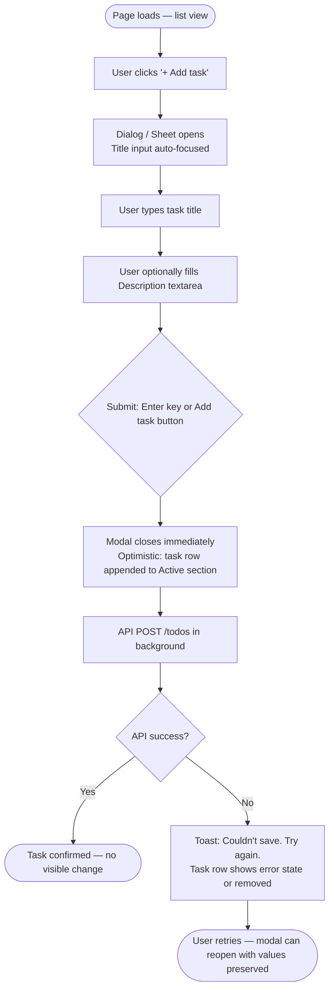
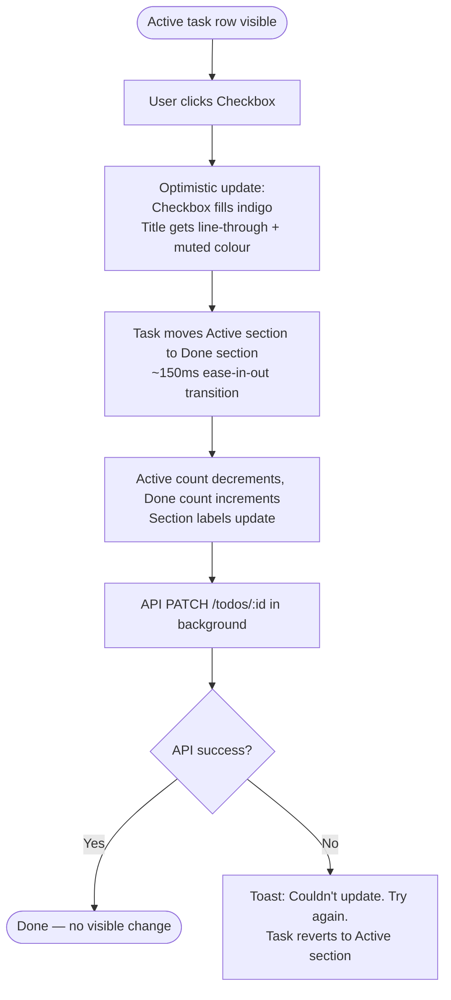
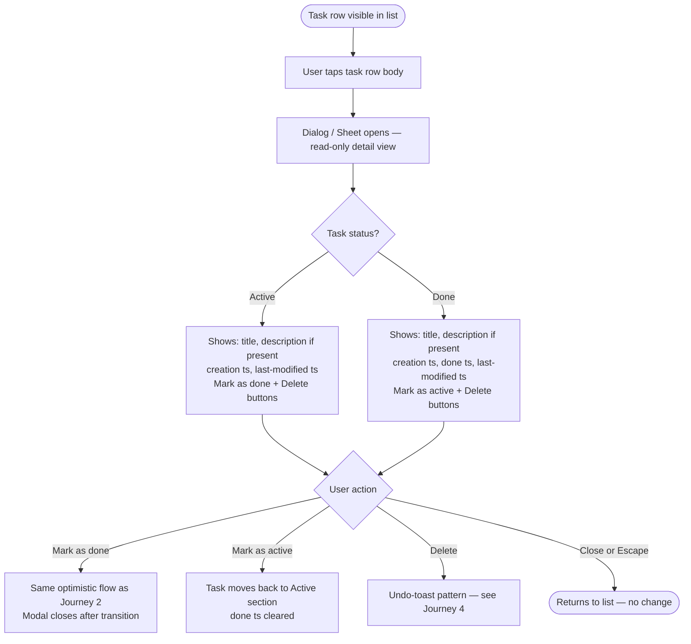
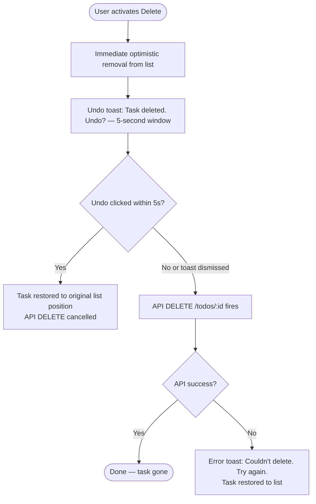

# UX Design Specification bmad-todo

**Author:** Salmen
**Date:** 2026-02-21

---

## Executive Summary

### Project Vision

bmad-todo is a radically minimal full-stack task management application built on a single
philosophy: task management reduced to its essence. The product deliberately excludes
everything that isn't the core loop — create, view, complete, delete — and treats that
restraint as a first-class design value. There is no onboarding, no configuration, no
accounts. A user opens the application and is immediately productive. The "aha" moment is
the first interaction: type a task, press Enter, it appears. That instant is the product.

### Target Users

**Primary — The Everyday Organizer**
Any individual who wants to track personal tasks without overhead, regardless of technical
background. They use the application across devices throughout the day — for quick task
capture on mobile and focused review and completion on desktop. Their defining frustration
is that every tool they've tried demanded setup, configuration, or onboarding before
delivering any value. Their success condition is simple: open the app, type a task, and
it's there — immediately, without friction.

**Secondary — The Developer / DevOps Maintainer**
The technical person who deploys and maintains the application. Values a clean, readable
codebase, single-command test runs, structured observable logs, and a README that removes
all ambiguity from the deployment process. Their success condition: deploy without
surprises, diagnose failures without code inspection.

### Key Design Challenges

1. **The empty state as the onboarding moment**: The first time a user loads the app,
   there are no tasks. This moment must feel inviting and immediately communicative —
   the empty state effectively replaces all onboarding UI. It must convey the entire
   product value at a glance.

2. **Completed vs. active task visual hierarchy**: Tasks must be distinguishable at a
   glance without adding visual noise. The completed state must feel conclusive without
   dominating the list — done items should recede, not disappear.

3. **Error recovery without alarm**: Network failures and server errors must be communicated
   clearly and calmly. Users should feel guided toward recovery, not confronted with
   failure. Input preservation on failure is non-negotiable — no user should ever retype
   a task.

### Design Opportunities

1. **Restraint as visual identity**: The intentional absence of features is the product
   differentiator. Every visual design decision — whitespace, typography, palette — is
   an opportunity to signal that philosophy. Simplicity is not a constraint; it is the brand.

2. **Micro-interactions as the primary delight surface**: With minimal UI, each interaction
   (task creation, completion toggle, deletion) becomes a high-visibility opportunity for
   satisfying tactile feedback. Subtle motion and state transitions can make the interface
   feel alive without adding visual complexity.

3. **Mobile-first task capture**: The quick-capture use pattern is inherently mobile.
   Designing thumb-friendly input, clear tap targets, and a comfortable one-handed
   experience positions bmad-todo ahead of desktop-centric alternatives on the device
   where tasks are most often captured.

---

## Core User Experience

### Defining Experience

The defining experience of bmad-todo is the moment of first task creation: the user taps
"Add task", types a title (and optionally a short description), submits, and the task
appears instantly in the Active section. No spinner. No confirmation beyond the act itself.
The interaction is complete. This moment — immediate, silent, frictionless — is the
product's entire value proposition made tangible. Everything else in the design serves to
protect and repeat this experience for every action the user takes.

### Platform Strategy

bmad-todo is a web application (SPA) running in modern evergreen browsers on both desktop
and mobile devices. The platform strategy is dual-first: desktop interactions are
keyboard-primary (type and Enter to submit, keyboard-navigable list), while mobile
interactions are touch-primary (thumb-friendly tap targets, comfortable one-handed use).
No offline functionality is required. No native app is in scope. The browser is the platform,
and the design must work excellently within it without relying on any platform-specific
capabilities beyond standard web APIs.

### Effortless Interactions

The following interactions must require zero cognitive effort — they should feel automatic:

- **Task creation**: A prominent "Add task" button opens a modal or off-canvas panel with
  the title field auto-focused. The user types a required title and an optional description,
  then submits. The panel closes and the task appears in the Active section immediately. The
  creation path is always one tap or click away — never buried.
- **Completion toggle**: A single click or tap marks a task done or undone. No confirmation,
  no intermediate state, no secondary action required.
- **Deletion**: A single click or tap removes a task. For a single-user, minimal app,
  multi-step deletion confirmation introduces friction that doesn't serve the user.
- **List visibility**: All tasks are visible on load without any action from the user.
  There is no pagination, no filtering, no navigation required to see the full list.

### Critical Success Moments

1. **The first task** — a new user taps "Add task", types a title, and submits. The
   modal closes and the task appears in the Active section immediately. No loading,
   no feedback dialog, no animation that delays the result. This is the moment the
   product proves its value.

2. **The return visit** — a user returns after closing the browser or taking a break.
   All tasks are there, exactly as they were left. This moment builds trust and converts
   a casual user into a habitual one.

3. **The error recovery** — a network failure interrupts an action. Instead of a broken
   experience, the user sees a calm, clear message and their input is still in the field.
   They retry, it works. Confidence in the application is preserved.

### Experience Principles

1. **Immediacy over confirmation** — every action reflects in the UI the instant it is
   taken; server confirmation happens in the background. The user is never made to wait
   for feedback they can already anticipate.

2. **Silence is signal** — the UI communicates only when something requires the user's
   attention. When everything is working, the interface is quiet. Modals, dialogs, and
   prompts appear only in failure states, never for routine actions.

3. **The input is always ready** — the task creation field is perpetually focused and
   accessible. There is never a reason to search for where to type, and no action should
   be required to begin entering a task.

4. **Failure is recoverable, not punishing** — errors are communicated calmly and
   constructively. They preserve user input, explain what happened, and point toward
   a clear recovery path. The user should never feel the application has broken.

---

## Desired Emotional Response

### Primary Emotional Goals

The primary emotional goal of bmad-todo is **calm confidence** — a quiet, settled feeling
of being in control. Users should not feel excited or impressed; they should feel that the
application is simply, reliably doing exactly what it's supposed to do. This emotional
register — trustworthy, steady, unobtrusive — is the product's emotional brand. The absence
of friction is the emotional experience.

### Emotional Journey Mapping

| Moment | Target Emotional Response |
|---|---|
| First load | Curiosity resolving immediately to clarity — "oh, that's all it is" |
| First task created | Confidence — "it just works, instantly" |
| Completion toggle | Satisfaction — a clean, conclusive sense of "done" |
| Task deletion | Relief — cleared, removed, gone without ceremony |
| Return visit | Trust — tasks are there, exactly as left; reliability proven |
| Error state | Calm reassurance — "something went wrong, but it's okay; try again" |

### Micro-Emotions

The most critical micro-emotional states for bmad-todo:

- **Confidence over confusion** — the UI never asks the user to guess what to do next or
  whether an action succeeded
- **Trust over skepticism** — every interaction and every session reinforces that the
  application is reliable and consistent
- **Satisfaction over delight** — bmad-todo does not aspire to impress or surprise; it
  aspires to feel *right* and *complete*
- **Calm over urgency** — nothing in the interface creates a sense of urgency, pressure,
  or alarm under normal conditions

Delight is available as a secondary surface through micro-interactions (subtle motion, clean
state transitions), but it is never the primary emotional objective. Delight that calls
attention to itself undermines the calm the product is designed to provide.

### Emotions to Avoid

The following emotional states are design failures for bmad-todo:

- **Anxiety** — caused by ambiguous states, missing feedback, or unclear error messages
- **Confusion** — caused by unclear affordances, hidden actions, or unexpected behaviour
- **Frustration** — caused by lost input, multi-step flows for simple actions, or
  inconsistent behaviour
- **Overwhelm** — caused by too much information, too many choices, or visual noise

### Design Implications

| Emotional Goal | UX Design Approach |
|---|---|
| Calm | Restrained neutral palette; no aggressive colours; quiet typography |
| Confidence | Optimistic UI updates — every action reflects immediately, no waiting |
| Trust | Strict visual and behavioural consistency across every session |
| Satisfaction | Clear, conclusive visual distinction between active and completed tasks |
| Calm in failure | Error messages that are informative and gentle, never alarming |

### Emotional Design Principles

1. **Earn trust through consistency** — the single most powerful emotional signal in
   bmad-todo is that the app behaves identically every time. No surprises, no drift,
   no changes the user didn't make.

2. **Let silence speak** — the most reassuring interface state is one where nothing
   demands attention. Visual quiet communicates that everything is working.

3. **Completion should feel conclusive** — when a task is done, the visual state must
   communicate finality without ambiguity. The user's effort has been acknowledged.

4. **Design for the error that builds trust** — a well-handled error (calm, clear,
   preserving the user's work) can *increase* trust in the application. Design failures
   compassionately, not apologetically.

---

## UX Pattern Analysis & Inspiration

### Inspiring Products Analysis

**Cal.com — "Clear UX. Do the thing right."**
Cal.com demonstrates that focus is a design decision. Each screen has one job, and the
layout serves that job without distraction. Purposeful whitespace, minimal chrome, and
task-oriented flows ensure the user always knows what they're there to do. For bmad-todo,
this translates directly: every UI element present must justify its existence; the layout
should make the primary action (entering a task) unmistakably the dominant affordance.

**TickTick — "Feels as native"**
TickTick achieves something rare on the web: it feels like a platform-native application.
On mobile, touch targets are sized correctly, gestures are natural (swipe-to-complete,
swipe-to-delete), and transitions feel like the OS rather than a webpage. On desktop,
keyboard shortcuts are first-class interactions. For bmad-todo, this means treating the
browser as a genuine platform — using standard web input behaviour, keyboard events, and
appropriate touch targets rather than fighting the medium.

**Things 3 — "Gorgeous and great to use"**
Things 3 is the reference standard for minimal todo UX. Its design language is
typography-led (generous size, clear weight hierarchy), its palette is warm and restrained,
and its whitespace is a deliberate design element — not empty space, but breathing room.
Most importantly, its completion micro-interaction (the checkbox animation) makes "done"
feel genuinely satisfying. At minimal scope, Things proves that craft applied to a small
surface area creates a product that users describe as beautiful rather than merely functional.

**VS Code — "Keyboard-first, good defaults, developer-trusted"**
VS Code delivers immediate productivity with zero configuration. Its information hierarchy
is clear — the editor is primary, everything else recedes into the chrome. Status is always
visible but never intrusive. The lesson for bmad-todo is about defaults: a new user should
find the application in exactly the right state, requiring no adjustment before they can
begin. The task input should be focused; the list should be visible; nothing should need
configuring.

### Transferable UX Patterns

**Interaction Patterns:**
- **Input as primary affordance** (Things, TickTick) — the task input field is the dominant
  interactive element; it should be large, clearly labelled, and auto-focused on load
- **Gesture-native deletion and completion** (TickTick) — on mobile, swipe-to-delete and
  swipe-to-complete are expected patterns; on desktop, inline action buttons revealed on
  hover preserve visual cleanliness
- **Satisfying completion animation** (Things) — the completion toggle should have a
  micro-interaction that makes "done" feel conclusive, not just a state flip
- **Keyboard-first on desktop** (VS Code, Things) — Enter to submit, Escape to cancel,
  keyboard-navigable list items

**Visual Patterns:**
- **Typography-led layout** (Things) — task text is the most important element; type size
  and weight hierarchy should make reading the list effortless
- **Whitespace as structure** (Things, Cal.com) — spacing creates visual groupings and
  breathing room without requiring dividers, borders, or containers
- **Receding chrome** (Things, VS Code) — UI controls (buttons, icons, actions) should
  visually recede when not in focus; the task list is the content, not the controls
- **Warm neutral palette** (Things) — a warm off-white background with neutral greys for
  supporting text, one accent colour for interactive elements only

**Navigation Patterns:**
- **Single-screen, single-purpose** (Cal.com, Things) — no routing, no views, no
  navigation hierarchy; the entire application exists on one screen

### Anti-Patterns to Avoid

Drawn from the failure mode of Jira and the explicit out-of-scope decisions of bmad-todo:

- **Feature scaffolding in the UI** — do not add empty sections, placeholders, or UI
  chrome for features that don't exist yet; every visible element should correspond to
  real functionality
- **Confirmation dialogs for simple destructive actions** — in a single-user, minimal
  app, requiring "Are you sure?" before deletion introduces friction that doesn't serve
  the user and implies a complexity the product doesn't have
- **Navigation required for basic actions** — if a user needs to navigate away from the
  task list to complete a core action, the design has failed
- **UI complexity before value delivery** — no configuration, no preference screens, no
  account setup; the list is the first and only thing the user sees

### Design Inspiration Strategy

**Adopt directly:**
- Things 3's typography hierarchy and whitespace philosophy — task text is first-class
- TickTick's platform-native interaction model — keyboard on desktop, gestures on mobile
- Cal.com's single-purpose screen discipline — one view, one job

**Adapt for bmad-todo's scope:**
- Things 3's completion micro-interaction — simplify to a CSS/JS animation appropriate
  for a web implementation; the feeling of "done" should be present without native-level
  complexity
- VS Code's status-always-visible convention — apply to error states only; when everything
  is working, nothing is displayed

**Explicitly avoid:**
- Any pattern from Jira's interaction model — no menus for simple actions, no navigation
  for basic tasks, no required configuration
- The common web app pattern of modal confirmation for all destructive actions — bmad-todo
  is low-stakes and should feel accordingly lightweight

---

## Design System Foundation

### Design System Choice

**Tailwind CSS + shadcn/ui**

A utility-first CSS framework (Tailwind CSS) combined with shadcn/ui — a collection of
accessible, copy-paste component primitives built on Radix UI and styled with Tailwind.
Components are owned in the project codebase, not imported from a package, meaning they
are fully customisable with no version lock-in and no visual opinions to override.

### Rationale for Selection

- **Accessibility handled at the primitive layer** — shadcn/ui components are built on
  Radix UI, which provides correct ARIA attributes, keyboard interaction, and focus
  management out of the box. This directly supports the zero critical WCAG violations
  requirement without requiring manual accessibility implementation for each component.

- **Full visual control via Tailwind** — unlike opinionated component libraries (MUI,
  Chakra), there are no default visual styles to override. The design looks exactly as
  designed — warm neutral palette, typography-first layout, generous whitespace — with
  no fighting against library defaults.

- **Aligned with the inspiration reference set** — Cal.com is built on Tailwind. The
  Things 3-inspired design language (restrained palette, whitespace-as-structure,
  typography hierarchy) translates naturally to Tailwind utility classes.

- **Good defaults, full ownership** — shadcn/ui components are copied into the codebase
  at init time. There is no upstream dependency to manage for component behaviour; updates
  are deliberate, not forced. This matches the VS Code "good defaults, developer-trusted"
  principle.

- **React ecosystem** — shadcn/ui is React-native, making it the natural choice for a
  React SPA frontend.

### Implementation Approach

- **Tailwind CSS** configured with a custom design token layer: palette (neutral warm
  tones + one accent), typography scale, spacing scale, and border radius
- **shadcn/ui** provides the following core components for this project:
  - `Input` — task creation field
  - `Button` — submit and delete actions
  - `Checkbox` — completion toggle
  - `Skeleton` — loading state
  - `Alert` / `Toast` — error and feedback states
- All components are customised via Tailwind utility classes and the `cn()` utility
  to match the design language defined in this specification

### Customization Strategy

- **Design tokens defined in `tailwind.config`** — all colour, spacing, and typography
  decisions live as named tokens, not raw values, ensuring consistency across components
- **Component variants for state** — each component (task item, input, button) will have
  Tailwind-driven variants for its states: default, hover, active, disabled, error,
  completed
- **No additional component libraries** — shadcn/ui + Tailwind covers all required
  components; no second library will be introduced, preserving bundle size and
  design consistency
- **Animation via Tailwind's `transition` utilities** — the completion micro-interaction
  (checkbox animation, task text strikethrough fade) implemented with Tailwind transition
  classes; no external animation library required for this scope

---

## Core Interaction Design

### Defining Experience

**"Add task. Title it. Submit. It's there."**

The defining experience of bmad-todo is task creation: the user taps "Add task", a
modal or off-canvas panel opens with the title field auto-focused, they type a required
title (and optionally a short description), and submit. The panel closes and the task
appears instantly in the Active section. No wait, no spinner, no intermediate step. The
interaction is complete. Every other design decision in this application exists to protect
and repeat this experience for every action the user takes.

### User Mental Model

Users arrive at bmad-todo with a well-established mental model for task creation via a
modal or panel — this pattern is used by Todoist, Linear, and most modern productivity
tools. It is familiar and expected. The key obligation is to execute it without friction:
one clear trigger, auto-focused field, fast submission, instant result.

For the task list, users expect title-only rows in the overview — density without noise.
Additional detail (description, timestamps) is available on demand by opening the task,
a pattern familiar from inbox and list applications everywhere.

Common failure modes to avoid:
- Modal is slow to open or fields are not auto-focused
- Title field is not clearly the primary/required field
- After dismissing the modal, the list does not immediately reflect the new task
- Task detail view requires navigation away from the list (must be in-place — modal or panel)

### Success Criteria

The core task creation experience is successful when:
1. The "Add task" trigger is immediately visible and reachable on both desktop and mobile
2. Opening the creation panel takes <100ms — it feels instant
3. The title field is auto-focused when the panel opens — no click required to begin typing
4. A submitted task appears in the Active section instantly, before API confirmation
5. The panel closes and the list is the focus again after submission
6. On API failure, the panel reopens (or remains open) with the entered values preserved
   and a clear inline error message shown

### Novel vs. Established Patterns

The core interaction uses entirely established patterns — there is nothing novel for
users to learn. The innovation is in the precision and quality of execution: the speed
of feedback, the satisfaction of the completion animation, the visual clarity of list
states. The goal is not to surprise users with something new, but to deliver something
familiar so well that they notice how right it feels.

### Experience Mechanics

**Task Creation (modal/off-canvas):**

| Stage | Behaviour |
|---|---|
| Trigger | User taps/clicks "Add task" button — always visible, top-right of list header |
| Panel opens | Modal (desktop) or off-canvas sheet (mobile) opens with title field auto-focused |
| Fields | Title (required, `text-base`); Description (optional, `text-sm`, multiline, below title) |
| Submission | Enter on title field (if description empty) or "Add" button submits |
| Optimistic update | Panel closes; task appended to Active section immediately, before API response |
| Error recovery | Panel reopens with entered values preserved; inline error shown below title field |

**Task List Row (title only):**
- Each row displays: Checkbox | Task title | Delete icon (hover/swipe)
- No description or timestamps visible in the list — title only
- A task row is tappable/clickable to open the task detail view
- Completed task title: `line-through text-muted`; checkbox filled with accent colour

**Task Detail View (modal/off-canvas):**
- Opens when user taps a task row (not the checkbox or delete icon)
- Displays all fields: title, description (if present, else placeholder text), creation
  timestamp, done timestamp (if completed), last-modified timestamp
- Read-only in MVP (editing is out of scope)
- Dismissed by clicking outside, pressing Escape, or a close button

**Task Completion (Toggle):**
- Single click or tap on the checkbox marks the task done or undone
- Completion animation: strikethrough fades in over ~150ms; task moves to Done section;
  checkbox fills with accent colour; section counts update immediately
- No confirmation required; no undo in scope
- Reverting to active is identical: single click, animation reverses, task moves back

**Task Deletion:**
- Desktop: trash icon appears on row hover (right-aligned, subtle opacity transition)
- Mobile: swipe-left gesture reveals a delete affordance
- Task disappears from list immediately (optimistic); API confirms in background
- On API failure: task reappears, error message shown

---

## Visual Design Foundation

### Color System

A warm neutral palette with a single purposeful accent colour. The palette is derived
from the calm confidence emotional goal and the Things 3 / Cal.com inspiration reference.

| Token | Value | Usage |
|---|---|---|
| `background` | `#FAFAF9` | Warm off-white page background |
| `surface` | `#FFFFFF` | Task item and card surfaces |
| `border` | `#E7E5E4` | Subtle dividers and input outlines |
| `text-primary` | `#1C1917` | Task text and headings — warm near-black |
| `text-secondary` | `#78716C` | Placeholder text, labels, metadata |
| `text-muted` | `#A8A29E` | Completed task text — receded, not gone |
| `accent` | `#4F46E5` | Indigo — checkbox fill, buttons, focus rings |
| `accent-hover` | `#4338CA` | Hover and active state of accent |
| `error` | `#DC2626` | Error messages — visible but not alarming |
| `error-surface` | `#FEF2F2` | Error state background tint |

**Accent rationale:** Indigo communicates calm reliability — it is used in the same register
by Cal.com and Linear. A single accent colour is used throughout; nothing else receives
colour treatment. This constraint enforces the "silence is signal" principle visually.

**Accessibility:** All text/background combinations meet WCAG AA contrast minimum (≥4.5:1
for body text, ≥3:1 for large text and UI components).

### Typography System

**Primary font:** Inter — clean, highly legible at all sizes, excellent at light weights,
the natural choice for a typography-first minimal interface. Loaded via
`@fontsource/inter` or system-ui fallback stack.

| Token | Size | Weight | Line Height | Usage |
|---|---|---|---|---|
| `text-xl` / 600 | 20px | Semibold | 1.25 | App title / page header |
| `text-base` / 400 | 16px | Regular | 1.5 | Task text — primary content |
| `text-sm` / 400 | 14px | Regular | 1.5 | Labels, empty state, error messages |
| `text-xs` / 400 | 12px | Regular | 1.5 | Metadata (reserved for future use) |

**Completed task text:** Same size and weight as active tasks, with `line-through`
decoration and `text-muted` colour — tasks recede visually when complete without
disappearing from the list.

**Minimum font size:** 14px for all user-facing text to maintain readability on mobile.

### Spacing & Layout Foundation

**Base unit:** 4px (Tailwind default — `1 = 4px`). All spacing values are multiples
of this unit, ensuring a consistent vertical rhythm throughout the interface.

**Page layout:**
- Maximum content width: `max-w-xl` (576px), horizontally centred
- Vertical layout only — single column, no sidebars, no grid
- Page padding: `px-4` on mobile; `px-0` at desktop breakpoint within the max-width container

**Component spacing:**
- Task input area: `py-6` top padding, separates from page header
- Task list: `mt-4` gap below input area
- Task item: `py-3 px-4` — generous vertical breathing room between items
- Task item gap: `space-y-1` between items — close enough to read as a list, spaced enough to tap individually on mobile

**Layout principles:**
- Everything a user needs is visible on a single screen for a reasonable task count
- Vertical flow only — the user scrolls the list, nothing else
- Whitespace is a structural element — spacing between sections communicates grouping
  without borders or dividers

### Accessibility Considerations

- All colour combinations meet WCAG 2.1 AA contrast requirements
- Interactive elements (checkbox, buttons, input) have visible focus indicators using
  the `accent` colour with a 2px offset ring
- Minimum touch target size: 44×44px for all interactive elements on mobile
- Task text and UI text minimum 14px — no text below this threshold
- Error messages use both colour and text — never colour alone — to communicate
  failure state (colour-blind accessible)

---

## Design Direction Decision

### Design Directions Explored

Eight base directions were explored covering: clean centred layout, floating cards,
minimal stark (no colour), warm paper, dark mode, sidebar layout, compact dense,
and large type. A hybrid exploration phase then evaluated three approaches to
active/done task separation (section labels, silent divider, collapsible) applied
to the chosen base direction, all rendered with real task data including creation
timestamps.

### Chosen Direction

**Direction 1 — Clean Centre with Section Labels (Option A) — updated**

A warm neutral single-column layout with:
- "Add task" button always visible (top-right of list header); tapping opens a
  modal (desktop) or off-canvas sheet (mobile) with title (required) + description
  (optional) fields
- Two explicit labelled sections: **Active · n** and **Done · n**
- Each task row showing **title only** — tappable to open task detail view
- Inline delete affordance (✕) right-aligned per row, revealed on hover/swipe
- Task detail view (modal/panel) shows all fields: title, description, all timestamps
- Indigo accent on checkbox fill, button, and focus rings

### Design Rationale

- **Section labels over silent separation**: Explicit `Active · n` / `Done · n` labels
  provide immediate status feedback — the user sees at a glance how many tasks remain
  and how many are complete. This directly supports the "confidence over confusion"
  micro-emotional goal without adding visual noise.
- **Title-only list rows**: The list is a scannable overview — only the title is shown.
  Description and timestamps are accessible in the task detail view on demand. This keeps
  the list clean and fast to scan regardless of how much metadata a task carries.
- **Modal/off-canvas creation**: A dedicated creation panel provides space for both
  required title and optional description without cluttering the list view. The pattern
  is familiar from modern productivity tools and scales gracefully to additional fields
  in future iterations.
- **Direction 1 base**: The warm neutral palette, indigo single accent, and
  typography-first hierarchy are the most direct expression of the Things 3 / Cal.com
  inspiration and the established visual design foundation.

### Implementation Approach

- Single-column layout, `max-w-xl` centred, `bg-[#FAFAF9]` page background
- List header: app title (left) + "Add task" `Button` (shadcn/ui, right-aligned, accent colour)
- Section headers: `text-[11px] font-semibold uppercase tracking-wider text-[#A8A29E]`
- Task item: flex row — `Checkbox` (shadcn/ui) | title text | delete icon (hover/swipe)
- Task title: `text-sm text-[#1C1917]`; completed: `line-through text-[#A8A29E]`
- Task row is fully clickable (except checkbox and delete) → opens task detail
- **Creation panel** (shadcn/ui `Dialog` on desktop, `Sheet` on mobile):
  - Title `Input` (required, auto-focused, `text-base`)
  - Description `Textarea` (optional, `text-sm`, resizable, below title)
  - "Add" `Button` (accent) + "Cancel" (ghost) in footer
- **Detail panel** (same `Dialog`/`Sheet` pattern, read-only):
  - Title (`text-base font-medium`)
  - Description (if present; else muted placeholder text)
  - Metadata block: creation timestamp, done timestamp, last-modified timestamp
  - Close button in header
- Completion animation: checkbox fill + strikethrough fade + section move, ~150ms `transition-all ease-in-out`
- Active section rendered first; Done section below with gap (`mt-4`) between groups


---

## User Journey Flows

> These flows build on the three PRD user journeys (Everyday Organizer success path,
> Everyday Organizer error recovery, Developer/Maintainer). They translate narrative
> into step-by-step interaction mechanics aligned with Design Direction 1 and the
> modal creation pattern.

---

### Journey 1 — Creating a New Task (Success)

**Entry point:** User sees the list view and clicks / taps **"+ Add task"** (top-right of header).



**Key design decisions:**
- Modal opens instantly — no API call before opening
- "Add task" button disabled until title has at least one character; description always optional
- Submit via `Enter` in the title field or button click
- On success: modal dismisses, task slides into Active section with subtle fade-in
- On API failure: optimistic row is marked failed; toast is clear and actionable; input values preserved

---

### Journey 2 — Completing a Task

**Entry point:** User sees a task row in the Active section.



**Key design decisions:**
- Checkbox interaction is immediate and optimistic — no spinner or loading state
- Section transition is animated but brief; user always sees where the task moved
- Undo is always available by re-tapping the checkbox on the completed task

---

### Journey 3 — Viewing Task Detail

**Entry point:** User taps anywhere on a task row body (except checkbox or delete icon).



**Key design decisions:**
- Detail view is read-only in MVP — no inline editing of title or description
- All 7 data model fields displayed where applicable, formatted as human-readable timestamps
- "No description added." shown as muted italic placeholder when description is empty
- Status action buttons available in detail view for convenience (not just from the list)

---

### Journey 4 — Deleting a Task

**Entry point:** Delete icon on task row (hover-reveal on desktop / always visible on touch) or Delete button in task detail view.



**Key design decisions:**
- No confirmation dialog — optimistic removal + undo toast removes friction while preserving recovery
- Server records `deletionTimestamp` on successful delete (soft-delete pattern)
- Aligns with "calm confidence" emotional goal: actions are fast, mistakes are cheap

---

### Journey Patterns

#### Navigation Patterns

| Pattern | Application |
|---|---|
| **Modal for focused action** | Creation and detail view both use Dialog (desktop) / Sheet (mobile) — the list remains the persistent context behind the overlay |
| **Single-column return** | After any modal action (add, close detail, complete from detail) the user always returns to the same list state |
| **Escape to dismiss** | All modals dismissible via Escape key or backdrop click |

#### Decision Patterns

| Pattern | Application |
|---|---|
| **Optimistic by default** | All mutations (create, toggle, delete) update the UI before the API call returns |
| **Rollback on failure** | If API call fails, UI reverts and shows a clear, actionable error message |
| **No confirmation dialogs** | Delete uses undo-toast; completion is always reversible via re-tap — both avoid interrupting flow |

#### Feedback Patterns

| Pattern | Application |
|---|---|
| **Section label counts** | `Active · n` / `Done · n` give immediate numeric feedback after every mutation |
| **Toast for async errors** | Network failures surface as non-blocking toasts, never as modal interruptions |
| **Animated transitions** | Task moves between sections with ~150ms ease-in-out — visible but never distracting |

---

### Flow Optimization Principles

1. **Minimum steps to capture** — Creating a task is 3 interactions: tap "Add task" → type title → press Enter. Description is always optional and never required.
2. **Context never lost** — Every modal and detail panel returns the user to the exact list state they left. No back-navigation required.
3. **Every action is reversible** — Toggle completion is a re-tap; deletion has a 5-second undo window. Users act with confidence because mistakes cost nothing.
4. **Errors are bridges, not walls** — Error states preserve input values and offer a direct retry path. The app never leaves the user stranded.
5. **Speed perceived, not just measured** — Optimistic updates mean the UI responds at the speed of the user's tap, not the speed of the network.


---

## Component Strategy

### Design System Components (shadcn/ui)

The following shadcn/ui components are used directly with minimal customisation:

| Component | Usage in bmad-todo |
|---|---|
| `Button` | "Add task" header trigger; modal action buttons (Add, Cancel, Mark as done, Delete) |
| `Input` | Task title field in creation modal (required, auto-focused) |
| `Textarea` | Task description field in creation modal (optional) |
| `Checkbox` | Task completion toggle on each row |
| `Dialog` | Desktop creation modal and task detail panel |
| `Sheet` | Mobile off-canvas creation modal and task detail panel |
| `Sonner` (Toast) | Error feedback and undo-delete notification |
| `Skeleton` | Loading state placeholder rows in task list |
| `Separator` | Optional thin rule between Active / Done sections |

All components are imported from `@/components/ui/` following the standard shadcn/ui installation pattern and styled via Tailwind utility classes using the established design tokens.

### Custom Components

shadcn/ui provides no opinion on task rows, section headers, empty state, or the app chrome layout. The following custom components are purpose-built for bmad-todo:

---

#### `AppHeader`

**Purpose:** Page chrome — app title and the sole entry point for task creation.

**Anatomy:** Flex row — `<h1>` "My Tasks" (left) + `<Button>` "+ Add task" (right, accent colour).

**States:** Static. Button inherits shadcn/ui `Button` default / hover / focus states.

**Interaction:** Clicking "+ Add task" opens `AddTaskModal`.

**Accessibility:** `<header>` landmark; button has `aria-label="Add a new task"`.

---

#### `SectionHeader`

**Purpose:** Separates Active and Done task groups and communicates count at a glance.

**Anatomy:** Single line — section label + `·` separator + live count.

**Variants:** `active` ("Active · n") / `done` ("Done · n").

**States:** Count updates reactively after every mutation.

**Styling:** `text-[11px] font-semibold uppercase tracking-wider text-[#A8A29E]`.

**Accessibility:** `role="heading" aria-level="2"`; count conveyed in text, not visually only.

---

#### `TaskRow`

**Purpose:** Core list item — the primary surface for viewing, completing, and deleting a task.

**Anatomy:** Flex row — `Checkbox` | title `<span>` (flex-1) | delete `<button>` icon (hover-reveal on desktop, always visible on touch).

**States:**

| State | Visual |
|---|---|
| Default | White bg, `text-[#1C1917]` |
| Hover | `bg-stone-50`, delete icon visible |
| Completed | `line-through text-[#A8A29E]`, checkbox filled indigo |
| Optimistic-pending | `opacity-60` while API call in flight |
| Error | Red left border, retry affordance |

**Interaction:** Checkbox click → toggle completion. Row body click (except checkbox and delete) → open `TaskDetailModal`. Delete icon click → trigger undo-delete flow.

**Accessibility:** `role="listitem"`; checkbox `aria-label="Mark '[title]' as complete"`; delete `aria-label="Delete '[title]'"`. Full keyboard navigability (`Tab`, `Space` on checkbox, `Enter` on row body).

---

#### `TaskList`

**Purpose:** Orchestrates the full list — renders Active section, Done section, loading skeleton, and empty state.

**Anatomy:** `<ul role="list">` with two subsections, each preceded by a `SectionHeader`. Falls back to `EmptyState` when no tasks exist.

**States:**

| State | Renders |
|---|---|
| Loading | 3 `Skeleton` placeholder rows |
| Empty | `EmptyState` component |
| Active tasks only | Single Active section |
| Done tasks only | Single Done section |
| Both | Active section + gap (`mt-4`) + Done section |

**Accessibility:** Container has `role="list"`; sections have `aria-label="Active tasks"` / `aria-label="Completed tasks"`.

---

#### `EmptyState`

**Purpose:** Zero-state guidance — tells the user there are no tasks and invites the first action.

**Anatomy:** Centred block — primary text + sub-text. No decorative icon in MVP.

**Content:** Primary: "No tasks yet." Sub: "Tap '+ Add task' to get started."

**Accessibility:** `role="status"` so screen readers announce the empty state.

---

#### `AddTaskModal`

**Purpose:** Composed creation panel — wraps `Dialog` (desktop) / `Sheet` (mobile) with the task creation form.

**Anatomy:**
- Header: "New Task" + close icon
- Body: `Input` for title (required, auto-focused) + `Textarea` for description (optional, with "optional" label hint)
- Footer: "Cancel" `Button` (ghost) + "Add task" `Button` (accent, disabled until title ≥ 1 char)

**States:**

| State | Behaviour |
|---|---|
| Idle | Title input focused, Add button disabled until input has value |
| Submitting | Add button shows spinner, inputs disabled |
| Error | Modal stays open, values preserved, Sonner toast fires |

**Interaction:** `Enter` in title field (when description unfocused) submits. `Escape` / backdrop click dismisses without submission.

**Accessibility:** `role="dialog"` and `aria-modal="true"` from shadcn/ui `Dialog`; title input has `aria-required="true"`; description has `aria-describedby` pointing to the "optional" hint text.

---

#### `TaskDetailModal`

**Purpose:** Read-only task detail panel — exposes all 7 data model fields with contextual action buttons.

**Anatomy:**
- Header: task title + close `×`
- Body: Description (or "No description added." in muted italic), then metadata rows — Created, Last modified, Completed / "Not completed yet"
- Footer: "Mark as done" / "Mark as active" `Button` (accent) + "Delete" `Button` (destructive outline)

**Variants:** Active (shows "Mark as done") / Done (title struck through, shows "Mark as active").

**Accessibility:** Same Dialog/Sheet accessibility as `AddTaskModal`; timestamps exposed as `<time>` elements with ISO `datetime` attribute.

---

#### `UndoToast`

**Purpose:** Composable Sonner toast that holds undo state for 5 seconds before committing a delete to the API.

**Anatomy:** Toast message ("Task deleted.") + "Undo" inline `<button>` + auto-dismiss.

**States:** Pending (undo available) → Committed (5s elapsed, API DELETE fires) or Cancelled (undo clicked, task restored).

**Accessibility:** Toast announced via `role="status"`; "Undo" is a focusable `<button>` within the toast.

---

### Component Implementation Strategy

- All custom components are built exclusively with **Tailwind utility classes** — no separate CSS files, no CSS-in-JS.
- shadcn/ui primitives (`Dialog`, `Sheet`, `Checkbox`, etc.) serve as the **accessibility and interaction foundation** — custom components wrap, never recreate, them.
- All state management (optimistic updates, error rollback, undo timers) lives **above** the component layer in the data/store layer; components only receive props and callbacks.
- Components are independently testable: each custom component should be exercisable in isolation with each of its states.

### Implementation Roadmap

**Phase 1 — MVP Critical** *(needed to render the complete core task loop)*

1. `AppHeader` — entry point for task creation
2. `SectionHeader` — required for Active/Done visual separation
3. `TaskRow` — primary interaction surface
4. `TaskList` — orchestrates all visible list states
5. `EmptyState` — handles the first-run experience
6. `AddTaskModal` — required for task creation flow

**Phase 2 — Core Quality** *(required for data model completeness)*

7. `TaskDetailModal` — exposes description and all four timestamps
8. `UndoToast` — makes deletion safe and recoverable

**Phase 3 — Polish** *(elevates perceived quality)*

9. Skeleton loading states in `TaskList`
10. Optimistic transition animations (`transition-all ease-in-out ~150ms`) on checkbox, task move, and row removal
11. Error boundary and graceful degradation for persistent API failures

---

## UX Consistency Patterns

### Button Hierarchy

| Level | Visual | Usage |
|---|---|---|
| **Primary** | Solid accent (`bg-[#4F46E5] text-white`) | One per view/modal — "Add task" in header, "Add task" in modal footer |
| **Ghost / Secondary** | Border-only (`variant="outline"`) | "Cancel" and close actions inside modals |
| **Destructive** | Outline red border (`text-[#DC2626] border-[#FCA5A5]`) | "Delete" inside `TaskDetailModal` only — never on the list |
| **Icon** | No bg, no border — icon only | Delete `×` on `TaskRow` (hover-reveal), close `×` in modal headers |

**Rules:**
- Never more than one primary button per surface.
- Primary button is disabled (not hidden) when its action is blocked — "Add task" stays visible but disabled until the title field has a value.
- Destructive actions are never primary-styled — always destructive outline, never accent solid.
- Loading state: spinner replaces button label, button stays disabled; width does not change.

### Feedback Patterns

| Situation | Pattern | Detail |
|---|---|---|
| Successful mutation (create, toggle, delete) | Optimistic UI only — no toast | List updates immediately; silent success is the intended UX |
| Delete (undo window) | Sonner toast + Undo action | "Task deleted. [Undo]" — 5-second auto-dismiss; Undo restores |
| API error on create | Sonner error toast; modal stays open, values preserved | "Couldn't save your task. Try again." |
| API error on toggle / delete | Sonner error toast; UI reverts | "Couldn't update. Try again." — optimistic state rolled back |
| Loading (initial fetch) | Skeleton rows | 3 `Skeleton` rows in `TaskList`, no spinner overlay |
| Network offline (detected) | Sonner warning toast | "You appear to be offline. Changes may not be saved." |

**Rules:**
- Only errors and undo actions surface as toasts — routine success is silent.
- All error toasts are actionable: message explains what failed + what to do.
- Toasts never block content; they are non-modal (Sonner anchors to viewport edge).
- Toast position: bottom-right on desktop, bottom-center on mobile.
- Max one toast visible at a time; new toasts stack or replace.

### Form Patterns

**Field order:** Required fields first, optional fields below. Labels always visible (no placeholder-as-label).

**Label styling:** `text-[11px] font-semibold uppercase tracking-wider text-[#78716C]`; optional fields add `(optional)` in normal weight muted text inline.

**Focus state:** shadcn/ui default blue ring (`ring-2 ring-[#4F46E5]`) — do not suppress.

**Validation:**
- Validation fires **only on submit** — never on keystroke (reduces anxiety, aligns with "calm confidence" goal).
- Required field empty on submit: red border + `text-[#DC2626]` error message below the field.
- Error message style: `text-xs text-[#DC2626]` directly below the field, no icon needed.

**Submit shortcuts:**
- `Enter` in the title `Input` submits the form (when description `Textarea` is not focused).
- `Enter` inside the `Textarea` inserts a newline (standard browser behaviour, not submit).
- `Escape` dismisses the modal without submit at any point.

**Empty state for optional fields:** Description `Textarea` placeholder text: `"Add more detail… (optional)"` in `text-[#A8A29E]`.

### Modal and Overlay Patterns

| Breakpoint | Component | Behaviour |
|---|---|---|
| Desktop (`≥ md`) | shadcn/ui `Dialog` | Centred overlay, `max-w-sm`, `rounded-xl`, backdrop click closes |
| Mobile (`< md`) | shadcn/ui `Sheet` (bottom) | Slides up from bottom, full-width, drag handle, backdrop click closes |

**Focus management:**
- On open → first interactive element receives focus automatically (title `Input` in `AddTaskModal`, close button in `TaskDetailModal`).
- On close → focus returns to the element that triggered the open.
- Focus is trapped inside the modal while open (`Dialog`/`Sheet` handles this via Radix UI).

**Close triggers:** Close `×` button, `Escape` key, backdrop click. All three must work consistently on both `Dialog` and `Sheet`.

**Scrolling:** Modal body scrolls internally if content exceeds viewport height; backdrop does not scroll.

**Nesting:** No nested modals in MVP.

### Empty and Loading State Patterns

**Loading (initial API fetch):**
- Show 3 `Skeleton` rows matching `TaskRow` height (`h-10`) and layout.
- No spinner overlay; list area shows skeletons, header is already visible and interactive.
- If fetch takes longer than 3 seconds, retain skeletons (do not show empty state prematurely).

**Empty state (no tasks exist):**
- Centred in the list area, below the `AppHeader`.
- Primary text: `"No tasks yet."` — `text-base font-medium text-[#1C1917]`.
- Sub-text: `"Tap '+ Add task' to capture your first task."` — `text-sm text-[#A8A29E]`.
- No duplicate button in the empty state — the header button is always visible; avoid redundancy.

**Empty Active section (all tasks done):**
- Active `SectionHeader` shows `"Active · 0"`.
- No empty-state callout for the section — count alone communicates the state.

### Interaction Patterns

**Optimistic updates:**
- All mutations (create, toggle, delete) update local state **immediately** — API call fires in background.
- If API fails: roll back local state + show error toast. No intermediate "saving…" indicator unless API call takes >1s.

**Undo affordance:**
- Delete is the only action with an undo window (5s).
- Completion toggle is always directly reversible (re-tap checkbox) — no undo toast needed.

**Hover and touch parity:**
- Delete icon: hover-reveal on desktop (`opacity-0 group-hover:opacity-100`); always visible on touch (`@media (hover: none)`).
- Row click area: full row body on both desktop and touch (minimum touch target `44px` height per WCAG 2.5.5).

**Animation cadence:**
- Checkbox fill + title strikethrough: `transition-all duration-150 ease-in-out`
- Task row move (Active ↔ Done): `transition-all duration-150 ease-in-out`
- Modal open/close: shadcn/ui default (~200ms fade + scale) — do not customise
- Toast appear/dismiss: Sonner default — do not customise

---

## Responsive Design & Accessibility

### Responsive Strategy

**Approach: Mobile-first, single-column, centred.**

The product's `max-w-xl` single-column layout is inherently responsive — no multi-column collapse is needed. Adaptation is concentrated on three things:

1. **Touch targets and spacing** — generously sized on mobile, slightly denser on desktop
2. **Modal pattern** — `Dialog` (desktop `≥ md`) vs. `Sheet` bottom-sheet (mobile `< md`)
3. **Delete icon visibility** — hover-reveal on desktop, always-visible on touch

**Desktop (`≥ md / 768px`)**
- Interaction model: keyboard + mouse
- `max-w-xl` list centred with horizontal whitespace — intentional, not wasted
- Task rows: `py-2.5` padding; delete icon via `group-hover:opacity-100`
- Creation / detail: shadcn/ui `Dialog` (centred overlay, `max-w-sm`)

**Mobile (`< md / 768px`)**
- Interaction model: touch; thumb-reachable layout
- Full-width list, `px-4` horizontal padding
- Task rows: `py-3` padding — minimum 44px height for WCAG touch targets
- Delete icon: always visible (`opacity-100`)
- Creation / detail: shadcn/ui `Sheet` (slides up from bottom)

**Tablet (768px–1023px):** Treated as desktop — `Dialog` applies, hover states active. No separate tablet layout needed.

### Breakpoint Strategy

Tailwind CSS default breakpoints, mobile-first. **Only one meaningful breakpoint is used:**

| Breakpoint | Width | What changes |
|---|---|---|
| (default) | all | Mobile styles: Sheet, always-visible delete, `py-3` row padding |
| `md` | ≥ 768px | Dialog instead of Sheet, hover-reveal delete, `py-2.5` row padding |

`sm`, `lg`, `xl` breakpoints add no layout change — the single-column design scales without them.

Modal implementation pattern:
```tsx
// Single TaskModal component renders the correct primitive
const isMd = useMediaQuery('(min-width: 768px)')
return isMd ? <Dialog>…</Dialog> : <Sheet>…</Sheet>
```

### Accessibility Strategy

**Target compliance: WCAG 2.1 Level AA** — industry standard for public-facing web applications. Level AAA is not required (and would conflict with the 5-second undo-delete timer).

**Colour contrast:**

| Pairing | Ratio | AA Requirement | Status |
|---|---|---|---|
| `#1C1917` text on `#FAFAF9` bg | 18.1:1 | ≥ 4.5:1 (normal text) | ✅ Pass |
| `#4F46E5` accent on `#FAFAF9` bg | 5.2:1 | ≥ 4.5:1 | ✅ Pass |
| `#A8A29E` muted on `#FAFAF9` bg | 2.5:1 | ≥ 4.5:1 | ⚠️ Fail for body text |

**Action required:** `#A8A29E` must only be used for non-informational decorators (placeholders, metadata labels, empty-state sub-text) — never as the sole carrier of required information. All task titles, error messages, and primary labels use `#1C1917` or `#4F46E5`.

**Keyboard navigation:**

| Interaction | Keys |
|---|---|
| Open "Add task" modal | `Tab` to button → `Enter` / `Space` |
| Focus title input | Automatic on modal open |
| Submit form | `Enter` in title field |
| Dismiss modal | `Escape` or backdrop click |
| Toggle completion | `Tab` to Checkbox → `Space` |
| Open task detail | `Tab` to row → `Enter` |
| Navigate rows | `Tab` / `Shift+Tab` |
| Delete task | `Tab` to delete button → `Enter` / `Space` |
| Undo delete | `Tab` to "Undo" in toast → `Enter` |

**Screen reader support:**
- Semantic HTML: `<header>`, `<main>`, `<ul role="list">`, `<li role="listitem">`, `<h1>`, `<h2>`
- Radix UI (under shadcn/ui) provides `role="dialog"`, `aria-modal`, focus-trap out of the box
- `aria-live="polite"` on the task list container — additions, completions, deletions are announced
- Section counts (`"Active · 3"`) are text-based — no visual-only numeric indicators
- All timestamps use `<time datetime="ISO-8601">` elements

**Touch targets:** Minimum 44×44px for all interactive elements (WCAG 2.5.5). `TaskRow` minimum height 44px on mobile; `Checkbox` wrapped in a 44px touch target; delete icon has `p-2` minimum padding.

**Reduced motion:** Respect `prefers-reduced-motion` by wrapping all transition utilities:
```tsx
className="motion-safe:transition-all motion-safe:duration-150 motion-safe:ease-in-out"
```
All animations are ≤ 200ms — below the vestibular disturbance threshold regardless.

### Testing Strategy

**Responsive testing:**

| Test | Method |
|---|---|
| Mobile layout | Chrome DevTools (375px, 390px) + real iOS Safari |
| Desktop layout | 1280px / 1440px Chrome |
| Modal pattern switch | Confirm Sheet at 767px, Dialog at 768px |
| Touch targets | Chrome DevTools accessibility overlay |

**Accessibility testing:**

| Test | Tool |
|---|---|
| Automated audit | axe DevTools — target zero violations |
| Colour contrast | Colour Contrast Analyser against full palette |
| Keyboard-only navigation | Manual: full task loop with no mouse |
| Screen reader | VoiceOver (macOS + iOS Safari) for core task loop |
| Reduced motion | Chrome DevTools: emulate `prefers-reduced-motion` |
| Focus indicators | Visual check — ring always visible, never suppressed |

### Implementation Guidelines

**Responsive:**
- All spacing uses Tailwind's `rem`-based scale — no raw `px` values in layout rules
- `max-w-xl mx-auto` on the root container — width constraint lives in one place
- Every desktop-specific style uses the `md:` prefix; default (no prefix) is always mobile
- Keep a single `TaskModal` component that renders `Dialog` or `Sheet` based on breakpoint

**Accessibility:**
- Never use `outline-none` without replacing with a custom focus indicator
- All icon-only buttons have `aria-label`; decorative icons have `aria-hidden="true"`
- `<time>` element for all timestamps with ISO `datetime` attribute
- `aria-live="polite"` on the task list container for dynamic content announcements
- Test keyboard navigation after every component change — focus traps and lost focus are the most common regressions
